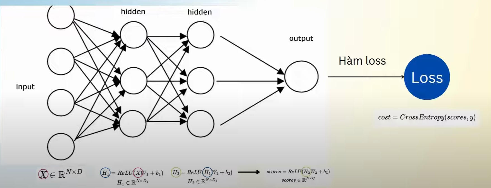
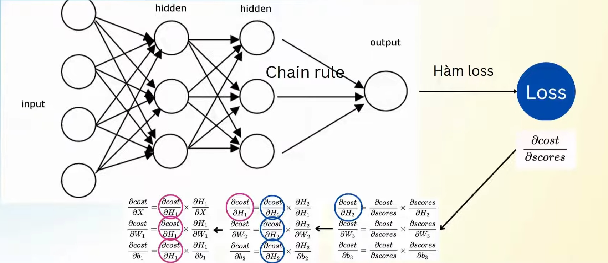

# BÁO CÁO THỰC TẬP 2/7/2024 #

# Neural Network #

## Cấu trúc của Neural Network ##

* Input layer (lớp đầu vào): Chứa các giá trị đầu vào

* Hidden layer (lớp trung gian/lớp ẩn): Tính toán các giá trị trung gian dựa vào giá trị đầu vào. Lớp ẩn chứa các tham số có thể điều chỉnh được trong quá trình học.

* Output layer (lớp đầu ra): Giá trị đầu ra (dự đoán).

## Foward propagation ##

Ở trong một mạng nơ-ron nhân tạo có một quá trình gọi là "lan truyền tiến" (foward propagation). Trong quá trình này, giá trị đầu vào được sử dụng giá trị của các lớp trung gian, giá trị của các lớp trung gian này tiếp tục được sử dụng để tính toán giá trị của lớp trung gian tiếp theo. Sau đó sẽ xuất ra được giá trị đầu ra (giá trị dự đoán). 

Để đo lường được sự khác biệt giữa giá trị dự đoán và giá trị thực tế ta sử dụng hàm loss (loss function) cross entropy (cho bài toán multiclass classification).

Nhiệm vụ của neural network là điều chỉnh các tham số ở lớp ẩn để tối ưu hoá hàm loss đạt được giá trị nhỏ nhất. 

### Thiết kế lớp ẩn (Hidden Layer) ###

* Weight (W): Mỗi kết nối giữa các neuron được điều chỉnh bẳng trọng số, thể hiện mức độ quan trọng của đầu vào đối với kết quả của neuron.
  
* Bias (b): Ngưỡng là một giá trị độc lập được thêm vào, cho phép điều chỉnh đầu ra của neuron.

* Activation function: một hàm phi tuyến như sigmoid, tanh, ReLU giúp mô hình học các mối liên hệ phức tạp hơn.

### Phương trình lớp ẩn ###
$$
\begin{align*}
X (\text{input}) & \in \mathbb{R}^{N \times D} \\
W (\text{weight}) & \in \mathbb{R}^{D \times H} \\
b (\text{bias}) & \in \mathbb{R}^{H} \\
\text{output} & = \text{activation}(XW + b)
\end{align*}
$$

X: là một ma trận có kích thước NxD trong đó N là số ví dụ có trong tập train và D là kích thước của mỗi ví dụ. Nếu một ví dụ là một hình ảnh có kích thước 28x28 pixel thì ta có thể kéo dài hình ảnh ra thành một vector có kích thước 784. Và 784 là D hay là kích thước của mỗi ví dụ. 

XW+b: sẽ được sử dụng làm đầu vào của activation function để cho ra kết quả cuối cùng là output. Output sẽ là một ma trận có kích thước NxH trong đó H là kích thước của lớp ẩn. 

### Quá trình học - Forward pass ###

* Giá trị đầu vào X được sử dụng để tính toán giá trị của lớp ẩn H1 dựa trên phương trình lớp ẩn. Giá trị lớp ẩn H1 tiếp tục được sử dụng để tính toán giá trị lớp ẩn H2. Giá trị lớp ẩn H2 sẽ được sử dụng làm giá trị đầu vào của giá trị lớp ẩn cuối cùng để tính toán được giá trị đầu ra scores.

* Cuối cùng sử dụng hàm loss CrossEntropy để tính toán được sai số giữa giá trị đầu ra dự đoán và giá trị đầu ra y.

## Back propagation ##

Nếu như ở quá trình lan truyền tiến ta tính toán được sai số giữa giá trị đầu ra thực tế và giá trị đầu ra dự đoán thì ở quá trình lan truyền ngược (back propagation) ta tận dụng sai số này để điều chỉnh các tham số ở lớp ẩn (hidden layer) sao cho giá trị đầu ra dự đoán gần với giá trị đầu ra thực tế nhất. 

Quy trình:
* Đầu tiên ta tính toán giá trị đạo hàm riêng của hàm loss đối với giá trị đầu ra dự đoán.
* Sau đó sử dụng giá trị đạo hàm này kết hợp với quy tắc "dây chuyền" trong tích phân (chain rule) để tính toán đạo hàm riêng của hàm loss đối với từng tham số của lớp ẩn.
* Tiếp tục sử dụng đạo hàm của lớp sau để tính toán cho đạo hàm của lớp trước thông qua chain rule.

### Gradient Descent ###
Sau khi tính toán được đạo hàm riêng của hàm loss đối với từng tham số của lớp ẩn, ta sẽ áp dụng thuật toán Gradient Descent để giảm giá trị của hàm loss. 

$$
\begin{align*}
W_1 & := W_1 - lr \cdot \frac{\partial cost}{\partial W_1} \\
b_1 & := b_1 - lr \cdot \frac{\partial cost}{\partial b_1} \\
\\
W_2 & := W_2 - lr \cdot \frac{\partial cost}{\partial W_2} \\
b_2 & := b_2 - lr \cdot \frac{\partial cost}{\partial b_2} \\
\\
W_3 & := W_3 - lr \cdot \frac{\partial cost}{\partial W_3} \\
b_3 & := b_3 - lr \cdot \frac{\partial cost}{\partial b_3}
\end{align*}
$$

trong đó lr: learning rate. 

## Thực nghiệm ##
Việc triển khai model neural network theo các quy trình được trình bày ở trên dựa theo bộ dữ liệu Ảnh chữ số viết tay MNIST. 

Code không sử dụng các thư viện có sẵn cho các quá trình lan truyền tuyến hay lan truyền ngược mà xây dựng dựa trên ý tưởng và công thức của từng quá trình. Code sử dụng thư viện Numpy dành cho các công việc tính toán như phép nhân ma trận, ngoài ra còn có thư viện scikit-learn để xử lý dữ liệu đầu vào và matplotlib để trực quan hoá kết quả của quá trình training. 

Quy trình: 
* Nhập và xử lý bộ dữ liệu đầu vào MNIST trong `data_loader.py`.
* Sau đó viết các logic cho quá trình lan truyền tiến và lan truyền ngược trong `layers.py`.
* Tiếp theo tạo ra một class `neral network.py` để xây dựng model neural network theo các class ở trên.
* Cuối cùng viết phương thức train trong `train.py` để huấn luyện mạng neuron và ghi lại các thông tin quan trọng trong quá trình train.
* Việc triển khai code sẽ được làm ở `main.ipynb` để có thể dễ dàng quan sát các kết quả. 

