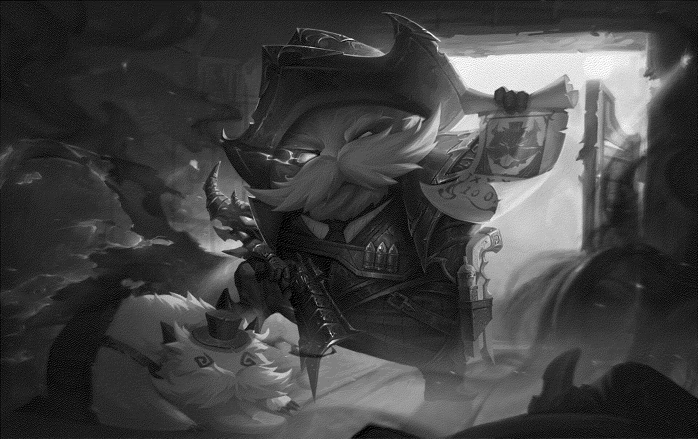
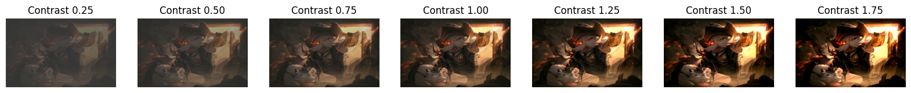

# PILLOW #
## PILLOW là gì? ##

PIL là viết tắt của Python Image Library. Đây là một trong những thư viện mạnh mẽ, hỗ trợ một loạt các định dạng hình ảnh như PPM, JPEG, TIFF, GIF, PNG và BMP.

PIL có thể giúp ta xử lý các thao tác cơ bản với hình ảnh giống với OpenCV như: 
* Để tải một hình ảnh, hãy sử dụng phương thức open ().
* Để hiển thị một hình ảnh, hãy sử dụng phương thức show ().
* Để biết định dạng tệp, hãy sử dụng thuộc tính format
* Để biết kích thước của hình ảnh, hãy sử dụng thuộc tính size
* Để biết về thuộc tính chế độ sử dụng định dạng pixel.
* Để lưu tệp hình ảnh sau khi xử lý, hãy sử dụng phương thức save (). Pillow lưu tệp hình ảnh ở định dạng png.
* Để thay đổi kích thước hình ảnh, hãy sử dụng phương thức resize () nhận hai đối số là chiều rộng và chiều cao.
* Để cắt hình ảnh, hãy sử dụng phương thức crop () lấy một đối số dưới dạng một bộ hộp xác định vị trí và kích thước của vùng được cắt.
* Để xoay hình ảnh, hãy sử dụng phương thức xoay () nhận một đối số là số nguyên hoặc số thực thể hiện mức độ xoay.
* Để lật hình ảnh, hãy sử dụng phương thức biến đổi () lấy một đối số trong số các đối số sau: `Image.FLIP_LEFT_RIGHT`, `Image.FLIP_TOP_BOTTOM`, `Image.ROTATE_90`, `Image.ROTATE_180`, `Image.ROTATE_270`.

## Một vài ví dụ thay đổi chất lượng hình ảnh bằng PIL ##
### 1.Chuyển ảnh màu sang Grayscale ###

### 2.Chuyển ảnh màu sang Halftone ###

### 3.Thay đổi độ tương phản (Contrast) ###

### 4.Thay đổi độ sáng (Brightness) ###

### 5.Làm mờ (Gaussian blur) ###

